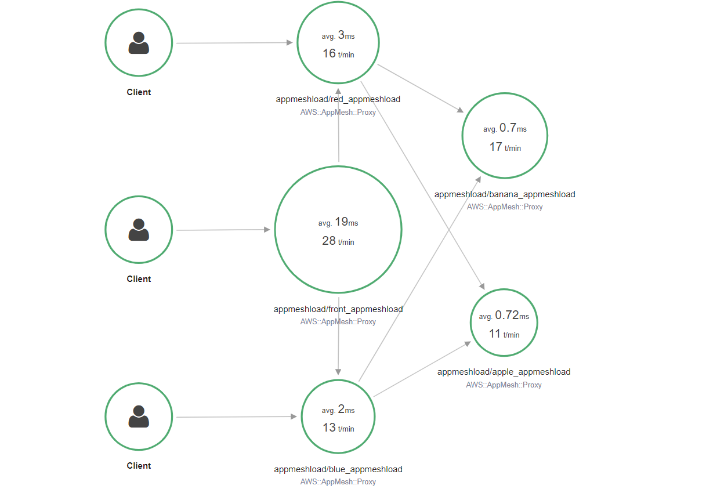

# appmesh-load

基于golang构建的简单http echo server，并通过环境变量控制监听和转发逻辑。

本仓库的出发点是为了解决测试mesh过程中找不到合适负载的问题。本server可以在eks，ecs，ec2环境中测试appmesh，尽可能始终使用一个镜像完成全部测试

为了实现负载的完整测试逻辑，需要后端负载满足以下要求

- 响应health check
- 根据环境变量中的text和port监听不同的端口并返回给定的response
- 根据环境变量中的host请求上游服务
- 延迟响应
- 支持故障注入和故障恢复
- 支持shell会话登入

要启动服务器，请运行以下命令：

```golang
go run main.go
```

## 环境变量设置

默认情况下，服务器监听端口为 8090。您可以通过设置环境变量来控制响应逻辑：

```shell
# server 默认监听端口
export SERVER_PORT=8090
# server /get响应内容
export TEXT="test echo"
# response 延迟
export DELAY="0"
# server 转发请求默认地址
export FORWARD_HOST="127.0.0.1"
# server 转发请求端口
export FORWARD_PORT=8090
# server 转发请求路径
export FORWARD_PATH="/get"
# multi路径和forward一致
export MULTIHOST="http://127.0.0.1:8090/get"
# load负载情况
export CPULOAD = 0 # 单位负载为2500000000
```

## 路径和响应


支持的请求功能如下：

- /ping，健康检查
- /get，普通请求，server会将请求附带的所有header和body打印到日志中
- /forward，请求转发
- /fault，故障注入
- /recover，故障恢复
- /multihost，多个上游转发

例如以下示例

- server监听8090端口
- 转发请求host为www.example.com
- 转发目的端口为8091
- 转发请求上游服务器的路径为"/forward"
- 响应内容为"testecho"
- get和forward的延迟为3s

```shell
export SERVER_PORT=8090
export TEXT="testecho"
export DELAY="3"
export FORWARD_HOST="www.example.com"
export FORWARD_PORT=8091
export FORWARD_PATH="/forward"
export MULTIHOST="http://127.0.0.1:8090/get,http://www.example.com,http://www.bing/com"
```

默认参数如下

```golang
export SERVER_PORT=8090
export TEXT="testecho"
export FORWARD_HOST="127.0.0.1"
export FORWARD_PORT=8090
export FORWARD_PATH="/get"
export DefaultMultiHost = "http://127.0.0.1:8090/get"
export CPULOAD = 0 # 单位负载为2500000000
```

## docker运行

```dockerfile
docker run appmeshload -p 8090:8090 -e TEXT=helloworld
```

## 示例日志

```shell
2023/07/25 07:07:01 starting server on port 8091
2023/07/25 07:07:01 host unique identifer: 26e70804-b6de-4a8e-9301-f82a230a73ba
2023/07/25 07:07:01 response is: default echo
2023/07/25 07:07:01 forwatd request to 127.0.0.1:8091/get
2023/07/25 07:07:15 ========== forward ===========
2023/07/25 07:07:15 starting forward to http://127.0.0.1:8091/get
2023/07/25 07:07:15 received GET request from 127.0.0.1:37754
2023/07/25 07:07:15 Headers: map[Accept-Encoding:[gzip] User-Agent:[Go-http-client/1.1]]
2023/07/25 07:07:15 Body: {}
2023/07/25 07:07:15 ========== get ===========
2023/07/25 07:07:15 received GET request from 127.0.0.1:37760
2023/07/25 07:07:15 Headers: map[Accept-Encoding:[gzip] User-Agent:[Go-http-client/1.1]]
2023/07/25 07:07:15 Body: {}
2023/07/25 07:07:15 successfully forward request to upstream server http://127.0.0.1:8091/get
```

## 示例请求
```
# for i in {1..10} ;do curl http://192.168.36.250:8090/forward;sleep 1;done
[single forward] front ==> [single forward] blue ==> apple
[single forward] front ==> [single forward] red ==> apple
[single forward] front ==> [single forward] blue ==> apple
[single forward] front ==> [single forward] red ==> banana
[single forward] front ==> [single forward] blue ==> apple
[single forward] front ==> [single forward] red ==> banana
[single forward] front ==> [single forward] red ==> banana
[single forward] front ==> [single forward] blue ==> banana
[single forward] front ==> [single forward] red ==> banana
[single forward] front ==> [single forward] blue ==> apple
```

# 测试示例

## 无网格转发

普通请求转发，没有mesh。图示图下


```shell
kubectl apply -f manifest/relay_init_nomesh.yaml
```

## 开启网格和xray

部署基础应用

```
kubectl apply -f manifest/relay_init.yaml
```

安装appmesh-controller，开启xray支持

```shell
helm upgrade -i appmesh-controller eks/appmesh-controller \
    --namespace appmesh-system \
    --set region=cn-north-1\
    --set serviceAccount.create=false \
    --set serviceAccount.name=appmesh-controller \
    --set image.repository=public.ecr.aws/appmesh/appmesh-controller \
    --set init.image.repository=919366029133.dkr.ecr.cn-north-1.amazonaws.com.cn/aws-appmesh-proxy-route-manager \
    --set sidecar.image.repository=public.ecr.aws/appmesh/aws-appmesh-envoy \
    --set tracing.enabled=true \
    --set tracing.provider=x-ray \
    --set xray.image.repository=public.ecr.aws/xray/aws-xray-daemon \
    --set xray.image.tag=3.3.3
```

授权appmeshload下的default sa

```
eksctl create iamserviceaccount \
    --cluster test126 \
    --namespace appmeshload \
    --name default \
    --attach-policy-arn arn:aws-cn:iam::aws:policy/AWSAppMeshFullAccess,arn:aws-cn:iam::aws:policy/AWSXrayFullAccess \
    --override-existing-serviceaccounts \
    --approve
```

开启ns注入

```
kubectl label namespace appmeshload mesh=appmeshload
kubectl label namespace appmeshload appmesh.k8s.aws/sidecarInjectorWebhook=enabled
```

部署网格资源

```
kubectl apply -f manifest/relay_mesh_resource.yaml
```

切换55流控

```
kubectl apply -f manifest/relay_mesh_resource_5v5.yaml
```

xray追踪map



## 暴露服务


在relay的基础上，暴露gw

```shell
kubectl apply -f manifest/relay_gw.yaml
```


## 手动注入故障到red

```shell
curl 127.0.0.1:8090/fault
host: 2f5b2e54-fcf6-4846-8f74-4e8ee22a1a5b will now respond with 500 on /get.
```

